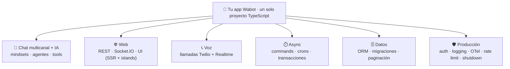

# 🤖 Wabot

<div align="center">

[](https://www.npmjs.com/package/@wabot-dev/framework)
[](https://opensource.org/licenses/MIT)
[](https://docs.wabot.dev)

**El framework TypeScript para pasar de un bot simple a una aplicación empresarial completa — sin cambiar de herramienta.**

Chat multicanal con IA · REST · Socket.IO · UI web · voz por teléfono · jobs & crons · datos con migraciones · auth · observabilidad — todo en un solo proyecto, cableado por decoradores.

[Documentación](https://docs.wabot.dev) • [Inicio Rápido](https://docs.wabot.dev/guides/start-new-project/)

</div>

---

## ⚡ AI-native: tu agente ya sabe construir con Wabot

Wabot **trae sus propios _skills_** para agentes de código. Con un comando, tu asistente (Claude Code, Codex, Cursor…) aprende los decoradores, patrones y convenciones del framework — y deja de alucinar APIs.

```bash
npx wabot-skills sync          # instala/actualiza los skills en tu proyecto
npx wabot-skills list          # ver los skills disponibles
```

Se instalan 15 skills —persistencia, mindsets, agentes, chat, REST/Socket, UI, voz, async, auth, ops, testing, validación, DI/config, design system y una skill paraguas del framework— versionados junto al framework. Actualizas el framework, corres `sync`, y tu agente sigue al día. **Esto acelera tanto a las personas como a los agentes que construyen contigo.**

---

## 🗺️ Un framework, todas las capas



Empiezas con **un bot de 15 líneas** y creces —front web, IA, cron jobs, base de datos, telefonía— **reutilizando los mismos servicios, mindset y tests**. El runner descubre tu código escaneando `src/`; cada subsistema es opt-in por decorador. Sin BD, todo corre **en memoria**; defines `DATABASE_URL` y el mismo código pasa a Postgres.

---

## 🚀 Quickstart

Un proyecto Wabot arranca desde `src/_run_.ts`:

```typescript
import { run, IProjectRunnerConfig } from '@wabot-dev/framework'

export const config: IProjectRunnerConfig = {}
export default config

if (process.env.WABOT_BUNDLED !== '1') run(config)
```

`run(config)` importa todo lo que encuentra en `src/` (los decoradores se registran como efecto de import) y levanta cada subsistema. **No hay listas de registro manuales.**

> 📘 Para crear un proyecto nuevo con plantilla, sigue la **[guía de inicio](https://docs.wabot.dev/guides/start-new-project/)**.

---

## 💬 Chat multicanal con IA

Define la **personalidad y las herramientas** del bot en un _mindset_, y conéctalo a uno o varios canales. El mismo mindset sirve para chat, voz y agentes.

```typescript
@mindset({ tools: [BacklogTools] })
export class PixelMindset implements IMindset {
  async describe(): Promise<IMindsetDescription> {
    return {
      identity: { name: 'Pixel', language: 'español', personality: 'Tendero 8-bit y sarcástico' },
      context: 'El jugador gestiona su backlog de videojuegos contigo.',
      skills: 'Listar, agregar, recomendar juegos.',
      limits: 'Nunca inventes juegos que el jugador no mencionó.',
      workflow: 'Saluda → entiende → gestiona el backlog.',
    }
  }
  async models(): Promise<IMindsetModels> {
    return { llm: [{ provider: 'openrouter', model: 'google/gemini-3-flash-preview' }] }
  }
}

@chatController()
export class PixelChatController {
  constructor(@chatBot(PixelMindset) private pixel: ChatBot) {}

  @cmd()
  @telegram({ botToken: process.env.TELEGRAM_BOT_TOKEN! })
  @whatsApp({ number: '+1555…', accessToken: '…', businessNumberId: '…' })
  async onMessage(ctx: IReceivedMessage) {
    await this.pixel.sendMessage(ctx.message, async (reply) => ctx.reply(reply))
  }
}
```

Las **tool functions** son métodos con `@description(...)` sobre una clase `@tools()`; sus argumentos se validan y tipan automáticamente. El LLM las invoca de verdad.

| Canales                                                                  | Proveedores de IA                                                     |
| ------------------------------------------------------------------------ | --------------------------------------------------------------------- |
| Terminal (`@cmd`) · Socket.IO · Telegram · WhatsApp Cloud API · WaSender | OpenAI · Anthropic (Claude) · Google (Gemini) · OpenRouter · DeepSeek |

---

## 🧠 Agentes de IA

Más allá del chat, expón **agentes para tu propio código**: pídele a un LLM una respuesta tipada, un sí/no, o dale una orden — con contexto y herramientas controladas. Un mindset puede **delegar en agentes** de forma autónoma (`@mindset({ agents })`) con _gating_ de tools por agente (`allow` / `deny` / `budget`). Los mismos `@tools` se reutilizan entre mindset y agentes.

---

## 🌐 Web: REST, Socket.IO y UI

**REST** con validación de DTO integrada y middlewares:

```typescript
@restController('/orders')
export class OrdersController {
  constructor(private orders: OrderService) {}

  @onGet('/:id')
  async getOne(req: { id: string }) {
    return this.orders.find(req.id)
  }

  @onPost()
  @middleware(AuditMiddleware)
  async create(req: CreateOrderRequest) {
    return this.orders.create(req)
  }
}
```

**Socket.IO** (`@socketController`, `@onSocketEvent`, guards de handshake) para tiempo real, con el mismo modelo de validación.

**UI server-rendered** — un framework de front real, no plantillas: renderiza **Preact en el servidor** y envía JS solo para las partes interactivas (_islands_). Escribes `@uiController` con `@view` (GET → HTML) y `@action` (POST → JSON); todo funciona sin JS y las islands son mejora progresiva. Incluye **navegación _boosted_** (SPA-like con layout + `<Outlet/>`), **generación estática (SSG)**, CSS modules y un **[design system](skills/wabot-design/SKILL.md)** con tokens y componentes accesibles listos para verse bien por defecto.

```tsx
@uiController('/board')
export class BoardController {
  @view('/')
  home() {
    return <HomePage messages={messages.value} />
  }

  @action('/add')
  add(dto: AddMessageDto) {
    addMessage(dto.text!)
    return redirect('/board')
  }
}
```

---

## 📞 Voz por teléfono

Bots de **llamadas en tiempo real** sobre Twilio, puenteados a un modelo _Realtime_ de OpenAI — con **el mismo Mindset** como cerebro. Entrantes y salientes, múltiples números/cuentas.

```typescript
@voiceController()
export class VoiceController {
  constructor(@voiceBot(PhoneAssistantMindset) private assistant: VoiceBot) {}

  @twilioVoice({ publicBaseUrl: str`public.base.url` })
  async onCall(call: IVoiceCall) {
    await this.assistant.answer(call, {
      greeting: call.greeting ?? 'Saluda breve y cálido, y pregunta en qué puedes ayudar.',
    })
  }
}
```

---

## ⏱️ Async: commands, crons y transacciones

Trabajo en segundo plano tipado: **commands** (inmediatos o programados), **cron handlers**, y `@transaction()` para envolver escrituras en una transacción de BD.

```typescript
@commandHandler(ChargeOrder)
export class ChargeOrderHandler implements ICommandHandler<ChargeOrder> {
  constructor(private payments: PaymentService) {}
  async handle(cmd: ChargeOrder) {
    await this.payments.charge(cmd.orderId, cmd.amountCents)
  }
}

@cronHandler({ name: 'daily-cleanup', cron: '0 3 * * *' })
export class DailyCleanup implements ICronHandler {
  async handle() {
    /* … */
  }
}

// Disparar / programar
await async.runCommand(ChargeOrder, { orderId: 'o_1', amountCents: 2500 })
await async.scheduleCommand(ChargeOrder, { orderId: 'o_1', amountCents: 2500 }, { minutes: 30 })
```

Sin BD usa stores en memoria; con Postgres, jobs y crons persisten automáticamente.

---

## 🗄️ Datos: ORM que escala contigo

Un ORM pequeño: defines una `Entity`, un `@repository` con **queries por nombre de método**, y opcionalmente extensiones por adapter. El backend (memoria o Postgres) lo elige el runner según `DATABASE_URL`.

```typescript
@repository({ table: 'game', constructor: Game })
export class GameRepository extends CrudRepository<Game> {
  @query() declare findByUserIdAndStatus: (userId: string, status: IGameStatus) => Promise<Game[]>
  @query() declare countByStatus: (status: IGameStatus) => Promise<number>
}

// Paginación por cursor (keyset), estable y O(1) sin importar la profundidad
const page = await games.findPage({ limit: 20, cursor })
```

- **JSONB por defecto**, con **índices automáticos** derivados de tus queries.
- **Migración a columnas relacionales sin tocar la lógica** cuando necesitas escalar — mismos `@query`, mismos tests.
- **Migraciones en SQL plano** con el CLI `wabot-migrate` (forward-only, checksum, advisory locks).
- **Paginación por cursor** integrada (`findPage` / `IPageOptions`).

---

## 🔐 Auth

Autenticación por **JWT** (access/refresh) y **API keys**, en endpoints REST y handshakes de Socket. Un servicio `Auth<D>` scoping por request:

```typescript
@injectable()
export class OrdersService {
  constructor(private auth: Auth<SessionInfo>) {}
  list() {
    const session = this.auth.require() // 401 si no hay sesión
    return this.repo.findByUserId(session.userId)
  }
}
```

Protege rutas con `@jwtGuard` / `@apiKeyGuard` (y sus variantes de handshake para Socket).

El token viaja en el header `Authorization: Bearer` o en una cookie. Cuando conviven **varios tipos de usuario en el mismo navegador** (por ejemplo un panel admin y el portal de clientes), dale a cada sesión su propia cookie y el guard sólo leerá la suya:

```typescript
@onPost('/admin/login')
async adminLogin(req: LoginRequest) {
  const { access } = await this.jwt.createToken(undefined, { audience: 'admin' })
  this.cookies.set('wabot_admin', access.token, { httpOnly: true, expires: access.expiration })
}

@onGet('/admin/orders')
@jwtGuard({ cookie: 'wabot_admin', audience: 'admin' })
list() { ... }

@onPost('/logout')
@jwtGuard({ cookie: ['wabot_admin', 'wabot_client'] }) // cualquiera de las dos
logout() { ... }
```

La cookie evita que las sesiones se pisen; el **`audience`** es lo que las aísla de verdad: como todas se firman con el mismo `JWT_SECRET`, sin `aud` un token de cliente movido a la cookie de admin pasaría el guard. Con `audience`:

- el access token lleva el claim `aud` y sólo lo aceptan los guards que declaran ese mismo valor (un guard sin `audience` acepta cualquier token válido);
- el refresh token recuerda su audiencia, así que `findRefreshTokenAuthInfo(secret, { audience: 'admin' })` rechaza renovar una sesión de cliente desde el endpoint de admin;
- también funciona en sockets: `@jwtHandshakeGuard({ audience: 'admin' })`.

Sin `cookie`, el guard usa `JWT_COOKIE_NAME` (`wabot_jwt` por defecto).

### Sockets con cookie `httpOnly`

El handshake acepta el token en `handshake.auth`, en `Authorization` o —única forma de usar una cookie que el JS del navegador no puede leer— en la cookie de sesión:

```typescript
@socketController({ namespace: 'admin' })
@jwtHandshakeGuard({ cookie: 'wabot_admin', audience: 'admin' })
export class AdminSocketController { ... }
```

Leer la cookie **exige** una allowlist de orígenes (`JWT_COOKIE_ALLOWED_ORIGINS=https://app.tudominio.com`, o `allowedOrigins` en el guard). El navegador adjunta la cookie a un WebSocket abierto por cualquier página y no aplica CORS sobre él, así que sin verificar el `Origin` cualquier sitio podría montarse sobre la sesión (_cross-site WebSocket hijacking_). El guard falla cerrado: sin allowlist, sin header `Origin`, con un origen no listado o con `*`, rechaza el handshake. Los tokens que llegan por `handshake.auth` no corren ese riesgo y no se verifican por origen.

Del lado del cliente, si el front está en otro dominio: `io(url, { withCredentials: true })`, `cors: { origin: '<origen exacto>', credentials: true }` en el server y la cookie con `SameSite=None; Secure`.

---

## 🛡️ Listo para producción

Utilidades transversales pensadas para operar de verdad — **todas con implementación en memoria + Postgres, elegida por `DATABASE_URL`**:

- **Logging estructurado** — legible en dev (`debug`), JSON en prod, con _correlation ids_ y niveles configurables (`WABOT_LOG_LEVEL`).
- **OpenTelemetry** — traces y métricas como _peer dependency opcional_.
- **Ciclo de vida** — _graceful shutdown_ central, manejo de crashes, `ShutdownManager.isShuttingDown` para readiness.
- **Locking distribuido**, **idempotencia / deduplicación de webhooks**, **rate limiting** (`@rateLimit` en REST, 429 + headers).
- **Config fail-fast** — valida referencias tipadas al arrancar (`ConfigError`), no en producción a medianoche.
- `CustomError` con códigos HTTP, `Password` (scrypt) y `Random` seguro.

---

## 🧪 Testing con evals de IA

`@wabot-dev/framework/testing` prueba chatbots de forma **determinista** —sin API keys ni BD— y evalúa comportamiento real con un **juez LLM**.

```typescript
import { createChatBotHarness, LlmJudge } from '@wabot-dev/framework/testing'

// Determinista: el LLM se simula, tus tools se ejecutan de verdad
const harness = createChatBotHarness({ mindset: PixelMindset })
harness.adapter.callTool('addToBacklog', { title: 'Celeste' }).reply('¡Agregado!')
const turn = await harness.send('agrega Celeste a mi backlog')

// Eval: juzga una conversación real con un LLM
const judge = new LlmJudge({ adapter, models: [{ model: 'claude-haiku-4-5' }] })
await judge.assert({ transcript: harness.history(), criteria: 'Responde en español y confirma' })
```

Hay harnesses para controllers de chat, REST (con guards JWT/API-Key reales), UI, sockets, commands/crons, repositorios en memoria (`useMemoryRepositories`) y una suite de _conformance_ para adapters LLM propios.

---

## 📦 Build & deploy

En dev, el framework descubre módulos escaneando disco. Para producción, empaqueta tu proyecto en un **único `dist/entry.js` autocontenido**:

```json
"scripts": {
  "dev": "node --import @yucacodes/ts ./src/_run_.ts",
  "build": "node ./node_modules/@wabot-dev/framework/dist/build/build.js",
  "start": "WABOT_BUNDLED=1 node ./dist/entry.js"
}
```

El build genera imports estáticos (sin `readdir` ni imports dinámicos en el bundle) y arranca en modo `preloaded`. Los addons opcionales (`pg`, SDKs de IA) quedan como `peerDependencies` y solo entran al bundle si los usas. Ver la sección _Building for production_ en la **[documentación](https://docs.wabot.dev)**.

---

## 📚 Documentación y skills

- 📖 **[Documentación oficial](https://docs.wabot.dev)** — guías completas en español.
- 🧠 **[Mentalidad del bot](https://docs.wabot.dev/guides/mentality-of-your-bot/)** · ⚙️ **[Agregar funcionalidades](https://docs.wabot.dev/guides/add-functions-modules/)**
- 🧩 **Skills del framework** (`skills/`) — la referencia que también consume tu agente de IA:
  [framework](skills/wabot-framework/SKILL.md) ·
  [persistencia](skills/wabot-persistence/SKILL.md) ·
  [mindset](skills/wabot-mindset/SKILL.md) ·
  [agentes](skills/wabot-agents/SKILL.md) ·
  [chat](skills/wabot-chat/SKILL.md) ·
  [rest & socket](skills/wabot-rest-socket/SKILL.md) ·
  [ui](skills/wabot-ui/SKILL.md) ·
  [voz](skills/wabot-voice/SKILL.md) ·
  [async](skills/wabot-async/SKILL.md) ·
  [auth](skills/wabot-auth/SKILL.md) ·
  [ops](skills/wabot-ops/SKILL.md) ·
  [testing](skills/wabot-testing/SKILL.md) ·
  [validación](skills/wabot-validation/SKILL.md) ·
  [di & config](skills/wabot-di-config/SKILL.md) ·
  [design](skills/wabot-design/SKILL.md)

---

## 🛠️ Contribuir & soporte

- 🐛 **Bugs:** [Issues](https://github.com/wabot-dev/wabot-ts/issues) · 💬 **Ideas:** [Discussions](https://github.com/wabot-dev/wabot-ts/discussions)
- 📧 **Email:** [contact@wabot.dev](mailto:contact@wabot.dev)

---

## 📄 Licencia

[MIT](https://github.com/wabot-dev/wabot-ts/blob/main/LICENSE)

<div align="center">

**Hecho con ❤️ por el equipo de Wabot**

[Sitio Web](https://wabot.dev) • [Documentación](https://docs.wabot.dev) • [npm](https://www.npmjs.com/package/@wabot-dev/framework)

</div>
